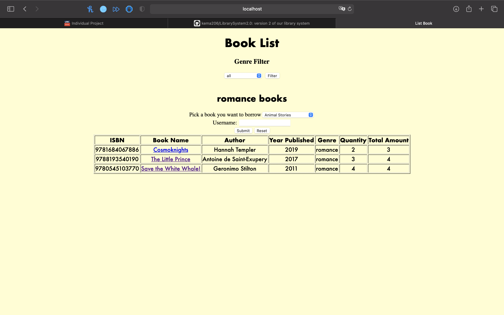

<H1> LibrarySystem2.0 </H1>
This version of our library system adds to our initial version 1 of our library system that can be found here: https://github.com/310g17/librarySystem  
This version of our library system adds to our initial version 2 of out library system that can be found here: https://github.com/310g17/LibrarySystem2.0  

This is a branch of the previous version of the Library system which purpose is as an individual project. Methods from the second version may remain, however, the code will slightly differ as 3 APIs were implemented.  
The initial goal still remains the same. This project is focused on the creation of a library system that primarily focuses on the borrowing feature of a library. The library system will be created as an app as the mobility of a mobile device is handy for librarians that want to check and see book. Furthermore, the website is centred around 5 main features and 3 APIs. The primary feature will be the ability to check in and check out, this system will function around the book database that tracks our stock of books. Aside from borrowing and returning books, also a filtering tool is implemented. There is another feature which is implemented, the idea of an individual account. Users and administrators will have their own accounts, each with different access levels. Administrators have access to the addition and removal of borrowable books in the database of books. To support the library in terms of its security, we have decided to implement a tracking system for books. If a person has borrowed 2 books or an overdue book (books borrowed for over 2 weeks) they are unable to borrow more. One API is Google Books API which gives users a detailed preview of the first few pages of each book. Next is the Google Visualization API which helps create a table containing reviews of the corresponding book. These APIs are implemented to help users decide whether to borrow the book or not. The last API , the Twitter API, is implemented to make the website's UI more interactive and fun. It is embedded in the login page and after a new user successfully create an account. The tweets embedded are definitely connected to reading and books. 
The website can be found under the web folder.
<H2>Data Flow Diagrams</H2> 
Our Data Flow Diagram (DFD) provides a preview of how data flows in our system. We provide two views, level-0 and level-1 DFD's.  
<h3>Level-0</h3>
Level-0 or L0 DFD's are meant to represent the most basic functionalities. It should represent all the high level functionalities. For this system, this is what our L0 DFD should look like:  

 

The high level functionalities here are highlighted. The arrows represent where the data flows and the labels tell you what it does. The difference between admins and users can be seen here. Admins are able to add or remove books from the system.  

<h3>Level-1</h3>
Our Level-1 or L-1 DFD should describe the high level functionalities and all the subprocesses that play a part in our system. This is what our L-1 DFD looks like:  

  

In this case, we can clearly see the dependencies of data. We begin at entity that is a user logging in. During the log in phase, users are able to make an account or log in to the system. User data is stored and taken from the user table in the database. Failure to log-in will send users back to the log in page. Then we move on to the process of choosing what the user wants to do. This process differs based on the data in the log in phase. If they are admins they are able to add and remove books on top of the other listed features. Upon choosing what to do, the database of books is updated and the user database is updated. Then results are updated and displayed.  

<h2>Features changed or added:</h2> 
1. Addition of a filter feature 
This feature was initially cut due to the constraints provided by a .csv system. Now, with the addition of SQL to our system, it's possible to use a relatively simple SELECT query to filter specific books. Filtering books would be a big deal in our system as it is integral for libraries to categorize and find books relatively fast. Even if it is just a simple filtering feature.  

 

 

 
 

2. Reprogramming older features (login, new account, add book, remove book) to suit our new SQL integration 
This feature was changed due to the complexity of our previous system. The previous system heavily relied on the .csv readers and writers. This made our code extremely inefficient. The amount of reads and writes we had to do also convoluted the code and was relatively messy.  

 

 

 
 

3. Addition of a GUI, from terminal to website  
Pairing the new SQL integration with the GUI also creates a better user experience as we're now adding buttons instead of relying on users typing (less errors). Furthermore, by using a website users do not have to download an application and can use the information easily. This solves the initial issue of users having to operate on a terminal and requiring expert knowledge to even open and operate the system. Users would need to use docker to access the website itself currently. This creates an issue of expert level set up. However, upon completion of set up the application no longer requires individuals to operate at an expert level. 

 

 

4. A new contact us feature 
To support users that might not understand how to operate the website, or if they have issues. We have placed a contact us button in the login page.  

 

 
 

5. SQL integration 
In version 2 of our program we are no longer using csv for the database. The csv format was causing limitations, and the SQL format allows for better integration.  
 
 

6. Twitter API implementation 
Implementation of Twitter API is used in login page and when a user successfully created account. A tweet is embended in the pages previously mentioned.
 

 

7. Google Books API (Book Preview) and Google Viualization API (Review Table) implementation 
Google Books API is used when users click the title of the book it shows a preview of the first pages for the users to determine which book to borrow. 
Google Visualization API is implemented in creating a table which shows rating of each book according to multiple trusted sources 
 

